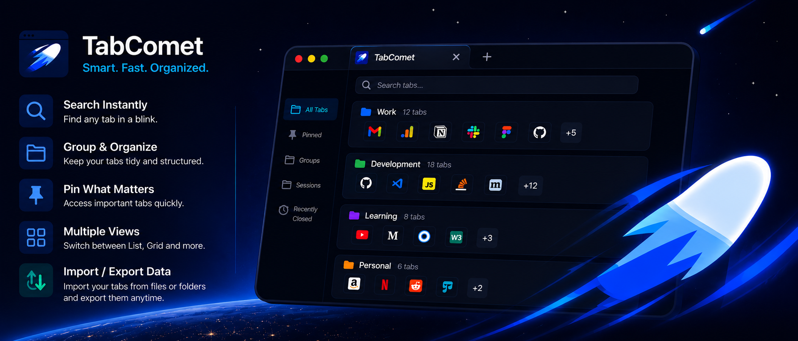

# 🚀 Hello, I'm Piyush

  

**QA Professional & Software Builder** utilizing AI-assisted development ("vibe coding") to rapidly ship products.  
I focus on designing products, defining features, testing, debugging, and shipping working software.

<!-- Social Links (Update URLs to uncomment) -->
<!--

  
  
  

-->

---

## 🌟 About Me

I enjoy turning ideas into working software by combining **product thinking, software quality, AI-assisted development, rapid iteration,** and **continuous learning**. 

I may not write every line of code manually, but I excel at defining features, writing detailed requirements, reviewing AI-generated code, debugging, and testing applications to ensure they are robust and production-ready. My GitHub is my authentic builder portfolio—everything you see here represents real projects I have shipped and can confidently discuss.

**Currently Building:**
- 🧠 Intelligent AI Agents & Automation Systems.
- 🛠️ Developer Tools & Productivity Software.
- 🧩 High-performance Browser Applications.

---

## 🚀 Featured Product: TabComet

  <!--  -->
  <h3>TabComet - The Ultimate Space-Themed Tab Manager</h3>
  
<i>Navigate your tabs at lightspeed.</i>

  
  
  
    
  
  <!--  -->

#### ✨ Core Features
- **Session Restoration:** Instantly save and restore massive tab sessions without memory bloat (lazy-loading via `chrome.tabs.discard()`).
- **Deep Search:** Instantly filter tabs by title or URL using optimized debounce algorithms.
- **Data Portability:** Export and import sessions seamlessly as JSON.
- **Premium UI:** Space-themed dark mode, glassmorphism, and smooth micro-animations.

**Tech Stack:** JavaScript (ES6+), Manifest V3, Chrome Storage API, Jest, Playwright.

---

## 🛠️ Building Projects Using

### AI & Agents

### Browser Extension Ecosystem

### Programming & Core Web

### Quality Assurance

### Analytics & Tools

---

## 📈 GitHub Stats

<!-- GitHub Stats (Uncomment once stats correctly generate for your username) -->
<!--

  
  

 

  

-->

---

## 🔮 What's Next (The Product Pipeline)

<!-- Use this modular template to add future products! -->

  
<b>🛠️ Coming Soon: Local AI Summarizer Agent</b>

   
  A secure, privacy-first browser extension that uses Chrome's built-in Gemini Nano model to summarize articles completely client-side without sending data to the cloud.

  
<b>🧪 Coming Soon: QA Automation Helper</b>

   
  An extension that automatically generates Playwright/Selenium test scripts based on your DOM interactions.

---

  <!--  -->
    
  <i>"Quality isn't just about finding bugs; it's about engineering products that don't have them in the first place."</i>

