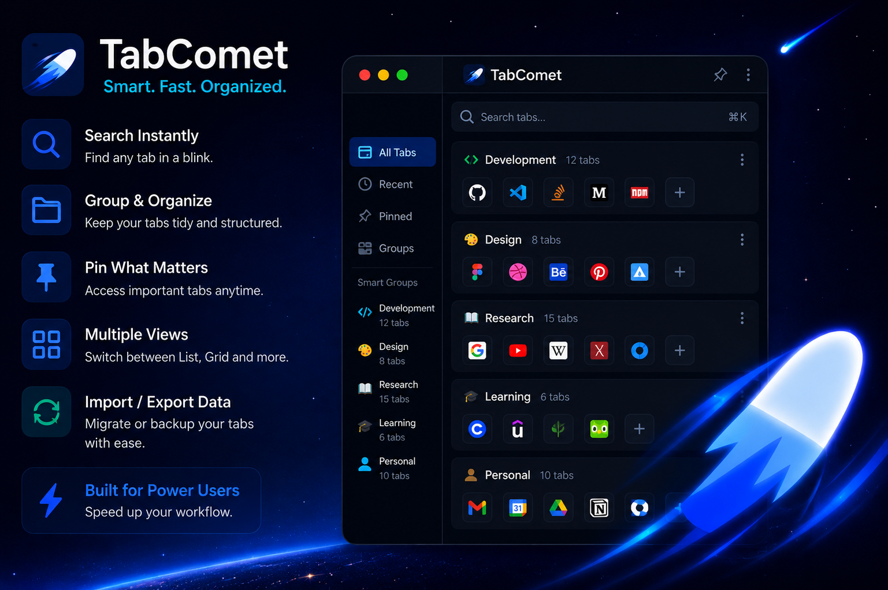

# Piyush Kumar

 

  

### 🚀 About Me

<table width="100%">
  <tr>
    <td width="100%">
      I build practical software products, focusing heavily on quality engineering and test automation. I leverage modern AI tools to accelerate my workflow, allowing me to concentrate on rigorous testing, complex state debugging, and scalable architecture.  
      <b>My Approach:</b> 
      ✅ <b>Quality First:</b> Integrating end-to-end testing into the product lifecycle from the beginning. 
      ✅ <b>AI-Assisted Workflow:</b> Utilizing AI to rapidly generate boilerplate and prototype features. 
      ✅ <b>Product Focus:</b> Delivering working, reliable applications rather than just writing code.
    </td>
  </tr>
</table>

 

### 🏆 Featured Product: TabComet

<table width="100%">
  <tr>
    <td width="60%">
      
    </td>
    <td width="40%">
      <h3>TabComet</h3>
      <i>High-Performance Tab Manager</i> 
      
A Chrome extension optimizing browser memory usage for power users.

      
      
        
      <b>✨ Engineering Highlights</b> 
      • <b>Memory Optimization:</b> Lazy-loading via <code>chrome.tabs.discard()</code>. 
      • <b>State Management:</b> Debounced search filtering. 
      • <b>Automated Quality:</b> Playwright E2E interactions. 
      • <b>Tech Stack:</b> JS, Manifest V3, Playwright.
    </td>
  </tr>
</table>

 

### 🛠️ Technologies I've Built With

<table width="100%">
  <tr>
    <th width="25%">🧪 Quality Engineering</th>
    <th width="25%">💻 Core Engineering</th>
    <th width="25%">⚙️ Automation & AI</th>
    <th width="25%">🛠️ Workflow</th>
  </tr>
  <tr align="center">
    <td>
        
        
      
    </td>
    <td>
        
        
        
      
    </td>
    <td>
        
        
      
    </td>
    <td>
        
        
      
    </td>
  </tr>
</table>

 

### 🎯 Current Focus

<table width="100%">
  <tr>
    <td>
      <ul>
        <li>🧪 <b>Test Automation:</b> Building robust end-to-end testing frameworks to automate browser extensions.</li>
        <li>⚙️ <b>AI Integration:</b> Integrating Agentic workflows (MCP, n8n) to streamline QA and development processes.</li>
        <li>🚀 <b>Product Refinement:</b> Refining TabComet based on real user feedback and expanding its test coverage.</li>
      </ul>
    </td>
  </tr>
</table>

 

### 📊 GitHub Analytics

<table width="100%">
  <tr>
    <td width="50%" align="center">
      <b>⭐ GitHub Stats</b>  
      
    </td>
    <td width="50%" align="center">
      <b>💻 Top Languages</b>  
      
    </td>
  </tr>
</table>

<table width="100%">
  <tr>
    <td align="center">
      <b>📈 Contribution Graph</b>  
      
    </td>
  </tr>
</table>

<table width="100%">
  <tr>
    <td width="50%" align="center">
      <b>🔥 Streak Stats</b>  
      
    </td>
    <td width="50%" align="center">
      <b>👀 Profile Metrics</b>  
      
    </td>
  </tr>
</table>
